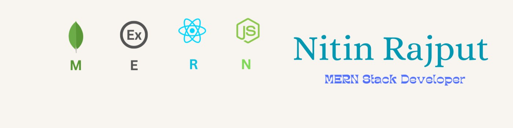

 

 

<h1 align="center">Hi 👋, I'm Nitin Rajput</h1>

<h3 align="center">A passionate Full Stack developer from India</h3>

  

  

- 🌱 I’m currently learning **Nextjs and tailwind and many more .**

- 👯 I’m looking to collaborate on **MERN Stack Project**

- 🤝 I’m looking for help with **MERN project**

- 👨‍💻 All of my projects are available at [https://nitinrajput.netlify.app/](https://nitinrajput.netlify.app/)

- 💬 Ask me about **Reactjs, Nodejs, Express, MongoDB, Html , Css , Js , Redux , Redux-Toolkit**

- 📫 How to reach me **nitinrajput971625@gmail.com**

- 📄 Know about my experiences [https://drive.google.com/file/d/1iiHrxLfRUbXuqgHfxmFlKN8bjwSAXTFB/view?usp=sharing](https://drive.google.com/file/d/1iiHrxLfRUbXuqgHfxmFlKN8bjwSAXTFB/view?usp=sharing)

- ⚡ Fun fact **I think i am funny 😎**
<h3 align="left">Connect with me:</h3>

  

 &nbsp;&nbsp;&nbsp;&nbsp;&nbsp; 

&nbsp;&nbsp;&nbsp;&nbsp;&nbsp;

&nbsp;&nbsp;&nbsp;&nbsp;&nbsp;

<h3 align="left">Languages and Tools:</h3>

  
  
  
  
  
  
  
  
  
  
  
  
  
  
  
  
  
  
  
  
  
  
  
  
  
  
  
  
  
  
  
  
  
  
  
  
  
  
  
  
  
  
  
  
  
  
  

 

  

 

 

  

  

<a> 
    
  
   
</a>

 
